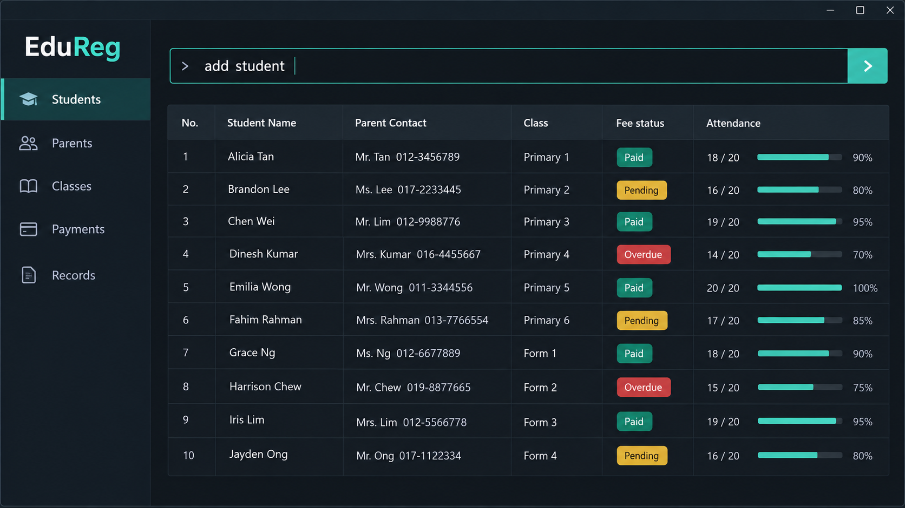

# EduReg

EduReg is a command-driven desktop application for small private tuition centres.
It helps administrative staff manage student and parent contacts, class rosters,
fee payments, and educational records using fast keyboard commands.

## Target users

EduReg is designed for administrative staff at small private tuition centres who
handle daily student enrolments, parent enquiries, class schedules, and fee
updates. These users prefer rapid keyboard commands over multi-step graphical
interface forms.

## Value proposition

EduReg centralises student-parent relationships, class rosters, fee payments, and
educational records in one command-driven tool. This helps tuition-centre
administrators update enrolments, manage records, and retrieve student details
faster than they could with multi-step GUI systems.

## MVP features

### Basic student management

1. Add a contact
2. Delete a contact
3. Search by student name
4. View student details

### Parent-student management

5. Add a parent contact to a student's details

### Application management

6. Save data to storage
7. Exit the application

## Documentation

For more information, see the [User Guide](docs/UserGuide.md) and [Developer
Guide](docs/DeveloperGuide.md).

## Acknowledgements

This project is based on the [AddressBook-Level3 project created by the SE-EDU
initiative](https://se-education.org).
