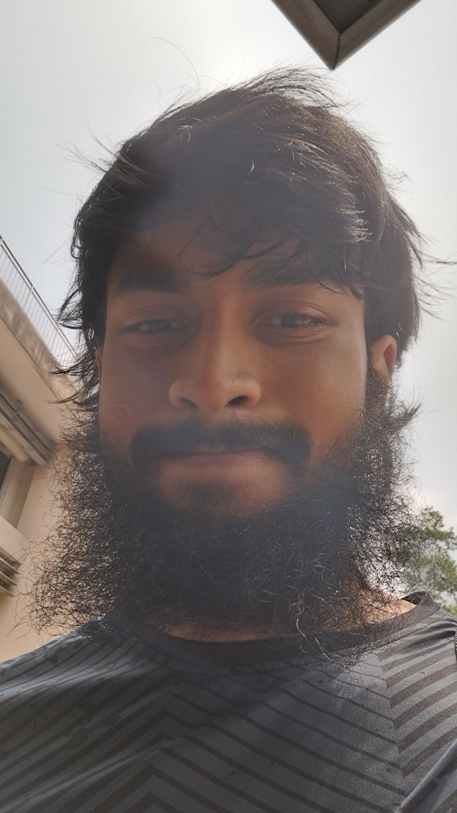
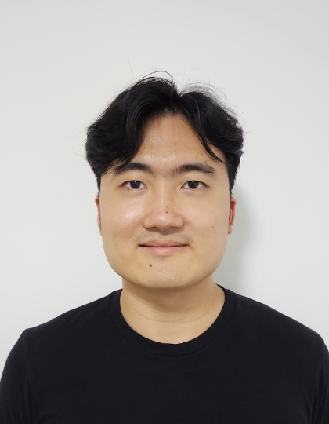

We are a team based in the [School of Computing, National University of Singapore](https://www.comp.nus.edu.sg).

You can reach us at the email `seer[at]comp.nus.edu.sg`

## Project team
### Phung Si Qi

[[github](https://github.com/tianyu487)]

* Role: Team Lead
* Responsibilities: Responsible for overall project coordination.

### Tianyu

[[github](https://github.com/tianyu487)]

* Role: Developer
* Responsibilities: Code quality (coding standards, code reviews)

### Shee En

[[github](https://github.com/HSE888)]

- Role: Documentation Lead
- Responsibilities: Coordinate and maintain the README, Developer Guide, User Guide, and project website documentation.

### Hoque Shehroz Awadul

[[github](http://github.com/BarcaBoy109)] [[portfolio](team/johndoe.md)]

* Role: Developer
* Responsibilities: Data, UI, Team Logistics

### Jean Doe

[[github](http://github.com/johndoe)]
[[portfolio](team/johndoe.md)]

* Role: Developer
* Responsibilities: Dev Ops + Threading

### James Doe

[[github](http://github.com/johndoe)]
[[portfolio](team/johndoe.md)]

* Role: Developer
* Responsibilities: UI

### Joel

[[github](https://github.com/joelyrk)]

* Role: Integration
